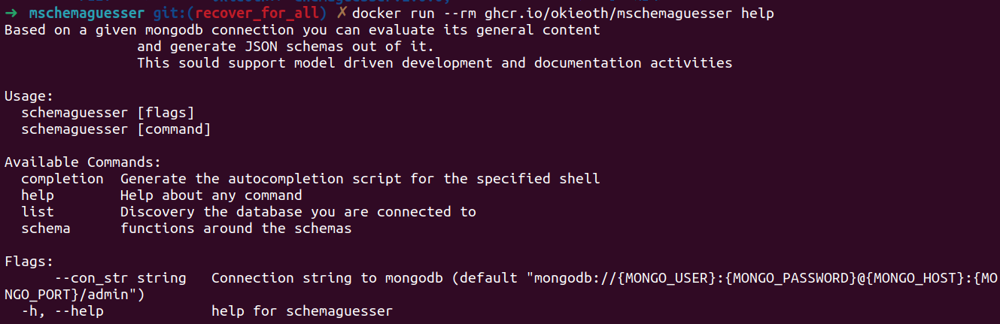

[](https://github.com/OkieOth/mschemaguesser/actions/workflows/test.yml)

# TL;DR;

Tool to guess storage models from mongodb



# Usage

If you have a mongodb installation by hand than you can use this. In
case you don't the repo contained docker compose stack is a good
starting point.

```bash
# start test environment with Mongodb
./docker/bin/compose_env.sh start
```

The default connection string is
`mongodb://{MONGO_USER}:{MONGO_PASSWORD}@{MONGO_HOST}:{MONGO_PORT}/admin`

It can be customized with the following environment variables:
* MONGO_USER - User to authenticate, if not set then `admin`
* MONGO_PASSWORD - Password to authenticate, if not set then `secretpassword`
* MONGO_HOST - IP address or server name to mongodb, if not set then `localhost`
* MONGO_PORT - port that is used, if not set then `27017`

In cases where it isn't enough to customize the env variables the commandline
switch `--con_str` can be used to provide a suitable connection string to the
program.


## Native
```bash
go build -o mschemaguesser cmd/schemaguesser/main.go

# print usage
./mschemaguesser --help

# query all existing databases
# in general MONGO_HOST can be skipped in case of localhost connections
MONGO_HOST=localhost ./mschemaguesser list databases

# export the schemas of all databases and their collections
# in general MONGO_HOST can be skipped in case of localhost connections
MONGO_HOST=localhost ./mschemaguesser schema --database all --output /tmp
```

## Docker

```bash
# print usage
docker run -u $(id -u ${USER}):$(id -g ${USER}) --rm \
     -e MONGO_HOST=192.168.178.52 \
     ghcr.io/okieoth/mschemaguesser --help

# query all existing databases
docker run -u $(id -u ${USER}):$(id -g ${USER}) --rm \
     -e MONGO_HOST=192.168.178.52 \
     ghcr.io/okieoth/mschemaguesser list databases

# export the schemas of all databases and their collections
docker run -u $(id -u ${USER}):$(id -g ${USER}) --rm \
     -v $(pwd)/tmp:/output_dir \
     -e MONGO_HOST=192.168.178.52 \
     ghcr.io/okieoth/mschemaguesser schema \
     --database all --output /output_dir
```

```bash
# show help
go run cmd/schemaguesser/main.go help

```
